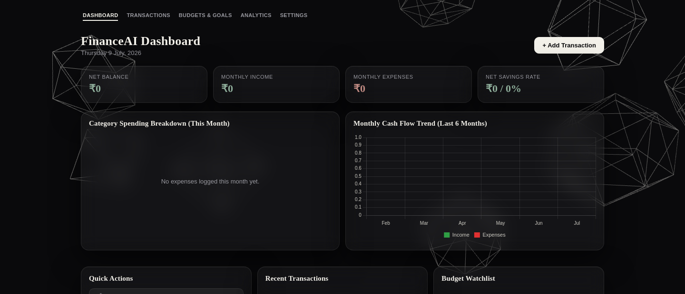
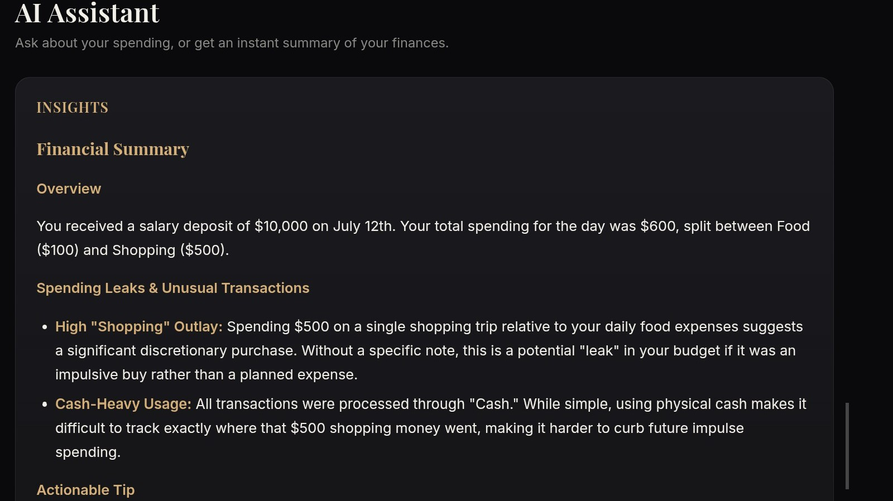
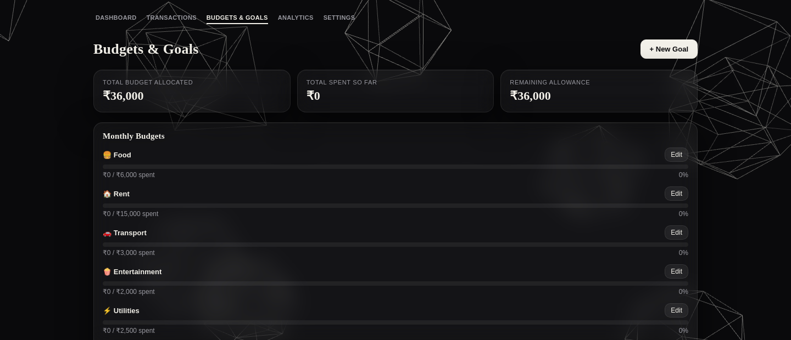
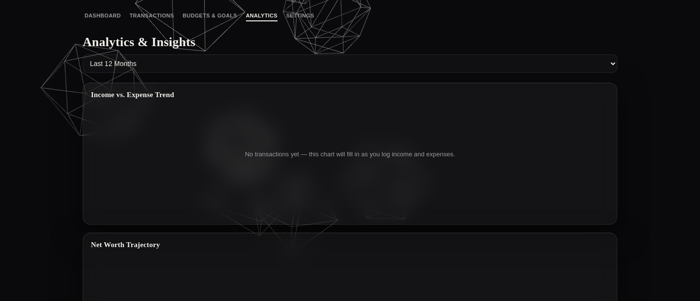

# FinanceAI

**See your money, clearly.**

A full-stack personal finance tracker with an AI assistant that actually reads your transaction history and tells you something useful — not just another dashboard with charts nobody looks at.

🔗 **Live demo:** [financeai-on7o.onrender.com](https://financeai-on7o.onrender.com)
> First load may take ~30-50s — free hosting tier spins down when idle.

---

## What it does

- **Dashboard** — net balance, income/expense, savings rate, and a 6-month cash flow trend, updated the moment you log something
- **Transactions** — searchable, filterable ledger; add, edit, delete
- **Budgets & Goals** — per-category monthly limits with visual warnings, savings goals with live progress rings
- **Analytics** — spending leaks, unusual transactions, and category breakdowns computed automatically
- **AI Assistant** — powered by Gemini; ask it questions about your spending in plain English, or get an auto-generated financial summary
- **Accounts** — real signup/login, each user's data is fully isolated from every other user's

## Tech stack

| Layer | Choice |
|---|---|
| Backend | Node.js, Express |
| Database | MongoDB Atlas |
| Auth | express-session + bcrypt (hashed passwords, server-side sessions) |
| AI | Google Gemini API |
| Frontend | Vanilla HTML/CSS/JS, Three.js for the landing page background |
| Hosting | Render |

## Screenshots

| Dashboard | AI Assistant |
|---|---|
| 



 | 



 |

| Budgets & Goals | Analytics |
|---|---|
| 



 | 



 |

## Running it locally

```bash
git clone https://github.com/nikhith128/Financeai.git
cd Financeai
npm install